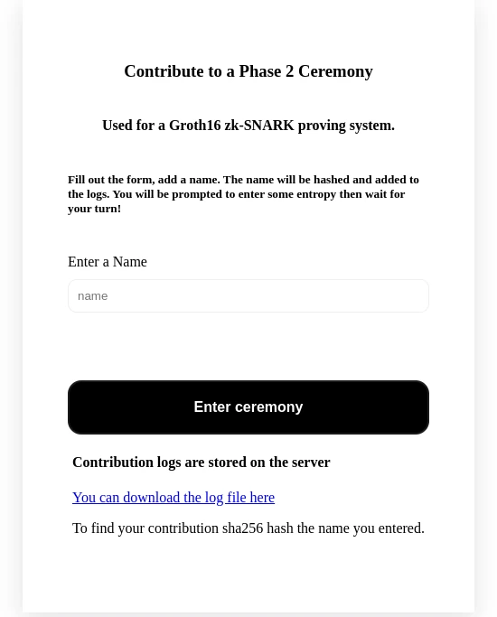

# NiftyZK CLI
**Scaffold a new Circom project, generate circuits, compile it and run Powers of Tau Phase-2 ceremonies. Generate a cosmwasm verifier contract. Supports Groth-16 with a BN128 curve**

Watch the explanation video here:

https://www.youtube.com/watch?v=FxS9JD8gtyo

## Dependencies

The application requires Rust, Circom and Nodejs to be installed.

Follow the installation guide for Circom
https://docs.circom.io/getting-started/installation/

# Install

Install the npm module straight from github

`npm install -g git+https://github.com/NiftyZk/niftyzk.git`

# Features

This is a command line toolkit for developers starting out using circom and writing contracts for the cosmos ecosystem. 

It currently supports groth16 proving system with a BN128 curve and generates 2 cosmwasm contracts contracts. One with the Arkworks Groth16 Rust dependency, the other using Bellman, the fork maintained by DoraFactory.
Using the Bellman based contract requires an adapter for the verification key and proofs, which will be auto generated for you.

# Commands

`niftyzk help`  - Display the help text

`niftyzk init [projectname]` - Run the initialization script to initialize a new project or add the dependencies to an existing local package.json if you omit the projectname.
The dependencies for the project are circomlib, circomlibjs,ffjavascript and snarkjs. Tests are ran using Jest,

`niftyzk ptaufiles` - Display information and download powers of tau files. The files were created as a phase 1 ceremony for Polygon Hermez and more information can be found about them in the Snarkjs repository.
A ptau file is required to compile circuits and proceed with the phase2 ceremony which is circuit specific. Not all downloadable files are compatible with the built in phase-2 ceremony due to their size. Never commit your ptau files, instead download them each time you use the project.

Optionally use the `--filename` flag to specify which file to download without waiting for a prompt to select it manually. Useful for automating the download of files.


`niftyzk gencircuit` - Generate the circom circuit with the option to add extra parameters. This will scaffold a circuit with a commitment reveal scheme using 2 secret inputs,`secret and nullifier` and public inputs `nullifierHash and commitmentHash`. 

The circuit was developed for on-chain use, where the knowledge of the commitmentHash pre-image is proven using a zkSnark, while the nullifierHash is used for avoiding proof replay. Different nullification strategies could be also used. You should modify the circuits to fit your needs.

The extra parameters added via input prompt will be used in hidden signals in the circuit to create tamper proof inputs. For example a withdrawal address which you don't want to hash into the commitment but still verify it's integrity. This makes the functions consuming zksnarks front run resistant and more versatile.

`niftyzk compile` - Compiles the circuits using circom with a BN128 curve and prepares the project for the phase-2 ceremony. The compiled circuit path defaults to `circuit.circom` but can be changed using the `--circuit [path]` flag.
After compilation, you can jump to creating the verification key and generating a contract for development or proceed with the phase-2 ceremony, after which the circuits can't be changed again.


`niftyzk ceremony` - Run a phase2 ceremony server for the circom circuits. It supports groth-16 proving system. The CLI contains a server that serves a webpage that allows for contributions. The project can be deployed on a VPS to host a ceremony. The server supports 25 simultaneous contributions in a queue. The contributions are anonymous, each contributor can verify their contributions by downloading the log file and comparing the entries with the `sha256sum` of the name they entered.



`niftyzk finalize --beacon [string] --iter [num] --name [string]` - Run the finalization of the zkeys, after the phase2 ceremony has been finished. The --beacon flag is required. It must be a valid hexadecimal sequence, without 0x prefix. The --name is required, it's the name of the final contribution. The --iter flag is the number of iterations, defaults to 10. Finalize will output a final.zkey which contains the phase-2 contributions and can be used to generate the verification key.

`niftyzk verificationkey --final` - Get the verification key from the zkey. When omitting the final flag, the  0000.zkey will be used, this is handy when developing and iterating on ideas. To create the verification_key.json from the finalized zkey, use the --final flag. This command writes the `circuits/compiled/vk_meta.json` for the tests, so the tests will know which zkey to use when creating a proof.

`npm run test` - You must run the scaffolded tests to proceed before generating the contracts. The tests output test proofs used for generating tests in Rust for the contracts. When developing circom circuits, always make sure the tests pass and output the required file.
Tests require the verification key. The zkey used for exporting the verification_key.json must be written to `circuits/compiled/vk_meta.json` for the tests to know which zkey to use. You may change your tests to work differently, this was just used for convenience.

`niftyzk gencontract --bellman --ark --overwrite --folder [string]` - Generate cosmwasm smart contract used for verifying the proofs. 

This must be ran after the verification_key.json has been generated and the tests successfully passed because the files outputted from the tests are used for the Rust tests too!

The library used for the verifier is either `--bellman` or `--ark` . 

Specify the directory for the contracts using the `--folder` flag. When using the same folder, the contract will be overwritten completely and so you must explicitly allow that to happen using the `--overwrite` flag. 

If you developed a custom cosmwasm contract already but want to generate a new one because you changed your circuits always use a different folder for the new contract, and then merge them manually where needed.

Note: `gencontract` depends on a file `circuits/compiled/test_proof.json` for creating the Rust tests. This file is outputted by the javascript tests. It contains a valid proof and publicSignals and verificationKey that must match the verification_key.json file and pass the verification.. 

If your tests can't write a file due to CI/CD or other reasons, you must make sure this file contains up to date data to generate valid Rust tests with. It is only used when creating a new Rust verifier.

## Checking the generated contracts
Install the wasm rust compiler backend:
`rustup target add wasm32-unknown-unknown`

Run `cargo test` to run the generated  tests

Build the contracts using `cargo wasm`

Verify the contract.wasm using the cosmwasm-check utility
`cargo install cosmwasm-check`

`cosmwasm-check ./target/wasm32-unknown-unknown/release/contract.wasm`

## Explaining the folder structure
NiftyZK is opinionated about folder structure.
The circuits directory need to look like the following:

```
├── circuit.circom  <-- The main circom circuit template
├── commitment_hasher.circom <-- The hasher circuit generated by the application, put all other circuits you develop next to this.
└── compiled  <-- All the files in this directory are generated.
    ├── circuit_js  <-- The output of the circom compiler. Used for computing proofs
    │   ├── circuit.wasm
    │   ├── generate_witness.js
    │   └── witness_calculator.js
    ├── circuit.r1cs  <-- The r1cs file is the output of the circom compiles
    ├── circuit.sym <-- Compilation artifact
    ├── test_proof.json <-- The test_proof.json is written after running npm run test. The javascript generated test proofs are used when generating rust tests for the cosmwasm contract. Without this the rust tests can't be generated successfully.
    ├── verification_key.json <-- The verification key exported by snarkjs
    ├── vk_meta.txt <-- Used for tests. Stores information about which zkey was used for the verification_key.json. 
    └── zkeys <-- The zkeys with the contributions for the phase-2 ceremony. The final key will be stored here
        └── circuit_0000.zkey
```

# Future Road map:

```


[x] More circuit generation parameters

   [x] Choose hashing algorithms when running gencircuit
      [x] Poseidon
      [x] Pedersen
      [x] Mimc7
      [x] MimcSponge 

[x] Merkle Trees and utility commands

   [x] Merkle trees

   [x] Generate fixed-sized populated trees (E.g: Pre-determined blockchain transaction parameters to distribute off-chain)

   [x] Compute and Validate Merkle Proofs

   [] Spare merkle trees

[] EDDSA
   [] EDDSA public key Merkle Tree

[] More optimized CosmWasm smart contracts

[] CosmWasm contract templates

[] Support for bls12_381 curve Rust verifier

[] Support for plonk Rust verifier

[] Support for fflonk Rust verifier
```  

## Available Hash functions:

* Poseidon Hash - Generally this is the recommended hash function to use
* Pedersen Hash - Use this for pedersen commitments
* MiMC7 and MiMCSponge - Requires a secret key to use which makes the use-case more limited

## Fixed Merkle Tree
 The fixed merkle tree uses no external dependencies. All functions (except the hash algorithms) are scaffolded in circom and javasscript.
 Fixed size trees have fixed levels, which is the `TREELEVELS` variable in the Javascript code and it's the levels argument of the circom circuit. They must match. The levels specify the max size of the merkle tree, which influences the constraint generation for the circuit and it also specifies the size of the merkle proof.
 The fixed size tree is always padded to the level size. Padding is done via duplicating the last leaf. 

The scaffolded project will contain merkle tree utility functions which can you can run via npm

`npm run new` will create a new merkle tree, using the selected hash algorithm

`npm run proof` will ask for the merkle root and a leaf (commitment) and output a merkle proof

`npm run verify` will take a root and a proof and verify the validity of the proof.

The code used for these commands is portable between nodejs and the browser.

When running npm run new, a new merkle tree will be saved to the local folder. The secrets used to create the commitments are stored in the `private` directory under the name of the merkle root. Do not check that file into git. The merkle tree leaves and a tree (which can be cached to avoid recomputing it, will be saved to the `public` folder with the merkle root as a name.


## Use-cases
The basic scaffold contains a commitment reveal scheme, which can be used for Account Abstraction, Identity, Privacy and other use-cases.
When using it with a merkle tree, the same use-cases exist but allow for others like Airdrops and Scaling. A merkle tree could contain multiple Identities or Deposits for which the ownership could be proven.

## Nullifier strategies
The nullifier scaffolded for the commitment reveal scheme is used to nullify the commitment on chain, which allows to mitigate double spending attacks for example. The commitment is hash(secret, nullifier) while the nullifierHash is hash(nullifier).

If the commitment is reusable because of the use-case of the DApp, e.g: it controls a reusable wallet, then a different nullifier strategy can be used, like: commitment = hash(secret, nullifier), nullifierHash = hash(nullifier, nonce), in this case the nonce is a random secret number, which makes the nullification reusable. Each time the user reveals the knowledge of the secret behind the commitment, the nullifierHash is a new value, while it stays linked to the commitment.
Experiment with different strategies to suit your use-case.